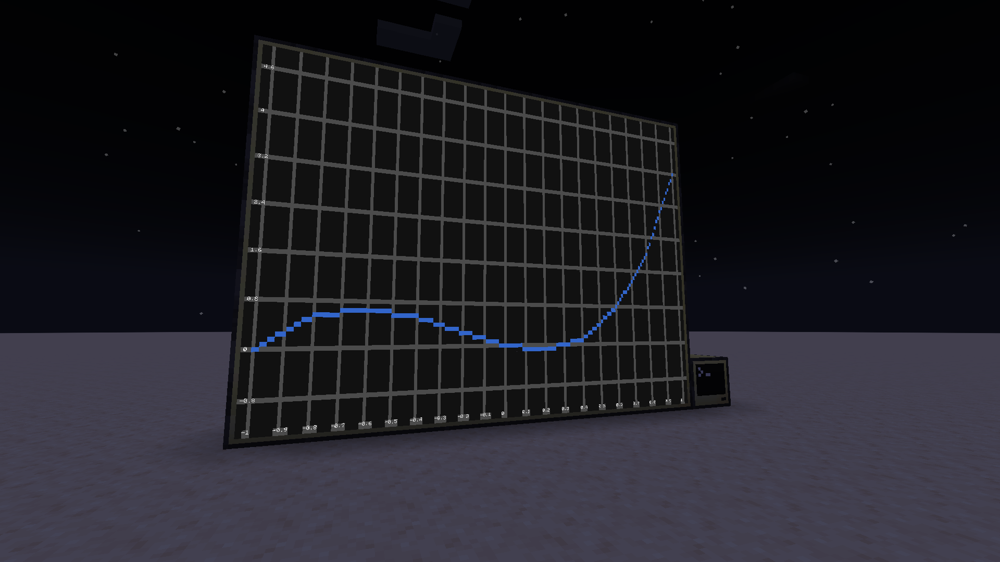
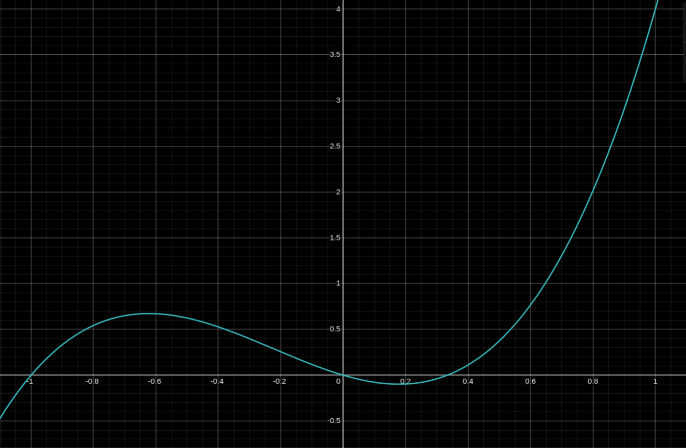
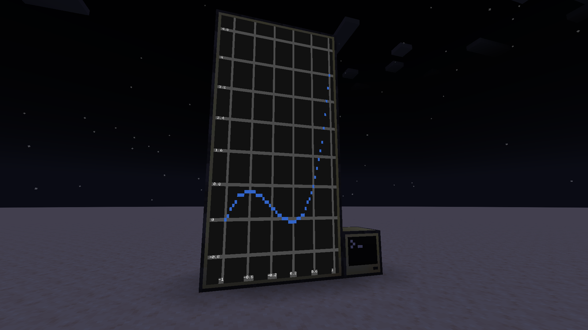
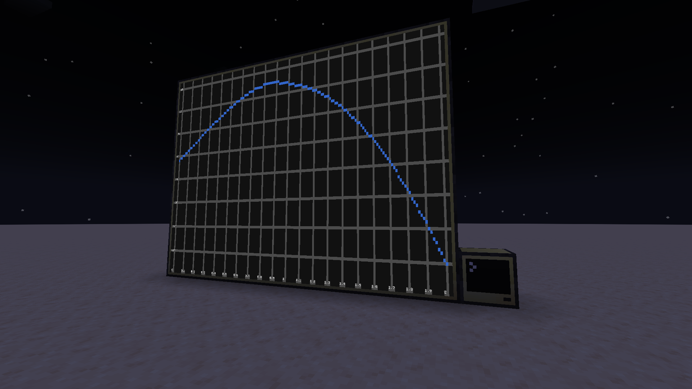
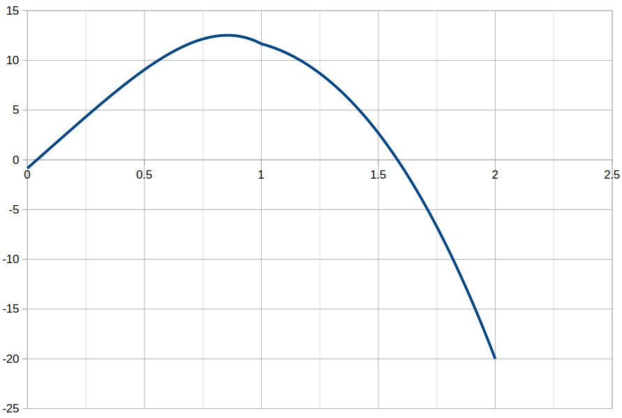

# FEM in ComputerCraft
  

A finite element method problem solved in lua and displayed in minecraft using the CC: Tweaked mod.  
Made for differential and difference equations course at AGH University of Krakow

# Running it yourself
1. Build a new computer with a monitor attached to its left side (as seen in the screenshots). The bigger the screen, the better, but the program supports monitors of all shapes and sizes.  
2. Copy the files in the `0` folder to the computers data folder (found at `saves/SAVE_NAME/computercraft/computer/COMPUTER_ID`).  
3. In game, run the `main N` or `test N` command where `N` is the number of sections.  

Tested in minecraft 1.20.1 with the fabric version of CC: Tweaked, but it should work on any newer and many older versions.

The files include many commented out or unused features so feel free to look around. 

# The creation process

## The test function
At first to test how the metod worked a known function was differentiated two times and the result solved using FEM.
 
### Function:  
$u = 3x^3 + 2x^2 - x$  

  
*screen taken from [desmos](https://www.desmos.com/calculator)*

### Problem:

```math
\begin{cases}
    u'' = 18x + 4
    \\
    u(-1) = 0
    \\
    u'(1) = 12
\end{cases}
```

### Weak formula derivation:  

```math
\begin{align}
u'' = 18x + 4 & \bigg| \cdot v(x) & v(-1) = 0 \\
u''v = 18xv + 4v & \bigg| \int\limits_{-1}^1dx \\
\int\limits_{-1}^1 u''v dx = \int\limits_{-1}^1 (18x + 4) v dx \\
u'v\Big|_{-1}^{1} - \int\limits_{-1}^1 u'v' dx = \int\limits_{-1}^1 (18x + 4) v dx \\
u'(1)v(1) - u'(-1)v(-1) - \int\limits_{-1}^1 u'v' dx = \int\limits_{-1}^1 (18x + 4) v dx \\
-\int\limits_{-1}^1 u'v' dx = \int\limits_{-1}^1 (18x + 4) v dx - 12v(1)
\end{align}
```

### Solution:  
The solution code is in the `solver.lua` file as `solver.solveTest(N)`  
Using the `test N` command with a fairly large `N` gives the following output (also seen on a larger screen at the top of the page): 

 

The result matches the original function - the algorithm was *probably* implemented successfully.  


## The actual problem
Now we can move on to the heat transfer problem.

### Problem:  

```math
\begin{cases}
    -\frac{d}{dx}(k(x)\frac{du(x)}{dx}) = 100x^2
    \\
    u(2) = -20
    \\
    \frac{du(0)}{dx} + u(0) = 20
    \\
    k(x) = \begin{cases}
        1  & x \in \langle0,1\rangle
        \\
        2x & x \in (1,2\rangle
    \end{cases}
\end{cases}
```

### Weak formula derivation:  

```math
\begin{align}
-(ku')' = 100x^2 & \bigg| \cdot v(x) & v(2) = 0 \\
-(ku')'v = 100x^2v  & \bigg| \int\limits_0^2dx \\
-\int\limits_0^2 (ku')'v dx = \int\limits_0^2 100x^2 v dx \\
-(ku'v) \Big|_{0}^{2} + \int\limits_0^2 ku'v' dx = \int\limits_0^2 100x^2 v dx \\
-k(2)u'(2)v(2) + k(0)u'(0)v(0) + \int\limits_0^2 ku'v' dx = \int\limits_0^2 100x^2 v dx \\
20v(0) - u(0)v(0) + \int\limits_0^2 ku'v' dx = \int\limits_0^2 100x^2 v dx \\
\int\limits_0^1 u'v' dx + \int\limits_1^2 2xu'v' dx - u(0)v(0) = \int\limits_0^2 100x^2 v dx - 20v(0) \\
\text{Including the shift} \quad \begin{cases}
    u = w + \bar u \\
    w(2) = 0 \\
    \bar u = -20
\end{cases} \\
\int\limits_0^1 w'v' dx + \int\limits_1^2 2xw'v' dx - w(0)v(0) = \int\limits_0^2 100x^2 v dx - 40v(0)
\end{align}
```

### Solution
The solution code is in the `solver.lua` file as `solver.solveHeat(N)`  
Using the `main N` command with a fairly large `N` gives the following output:  

  

Using the `fileExporter.lua` module the results can be exported to a `.csv` file and visualized using external software for better clarity:

  
*visualized in [LibreOffice](https://www.libreoffice.org)*
